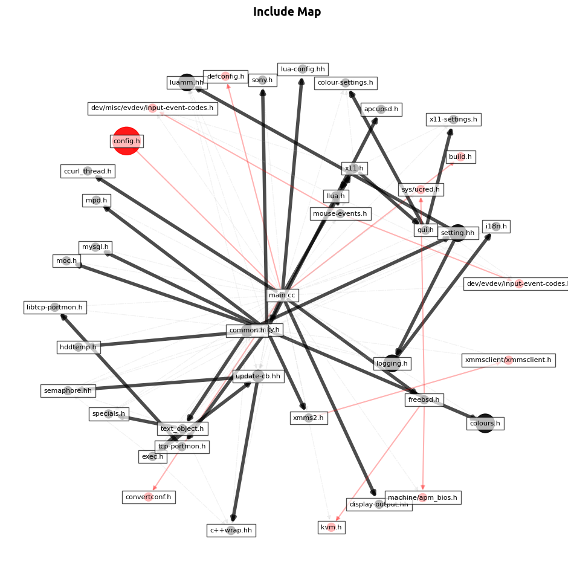

# cdepgraph

A tool that generates include graph from C/C++ source files.



It's very primitive and won't work for very unconventional projects, but it
should in most cases where:

- Local include headers are expected to have appropriate extensions (`.h`,`.hh`,`.hpp`,`.hxx`, etc.)
  - Headers without extensions are assumed to belong to stdlib
- Sources are expected to have appropriate extensions (`.c`,`.cc`,`.cpp`,`.cxx`, etc.)
- Compile flags aren't handled
- A single program entry point is expected (e.g. `main.cpp`)

## Usage

```
usage: cdepgraph [-h] [-m MAIN_FILE] [-i INCLUDE_PATHS] [-l] [-e] [-s] [-c] [-o OUTPUT] [-F OUTPUT_FORMAT] SOURCE_DIRECTORY

Generates include graph from C/C++ source files

positional arguments:
  SOURCE_DIRECTORY      Source directory containing program entry point

options:
  -h, --help            show this help message and exit
  -m MAIN_FILE, --main-file MAIN_FILE
                        Main file name and extension; default is any of main.c/cc/cpp/etc.
  -i INCLUDE_PATHS, --include-paths INCLUDE_PATHS
                        Semicolon (;) separated list of additional include paths
  -l, --std-lib         Include standard library includes in produced graph
  -e, --system          Include system includes in produced graph
  -s, --strict          Exclude includes which can't be found
  -c, --check-sources   Check includes of corresponding source files
  -o OUTPUT, --output OUTPUT
                        Output file name
  -F OUTPUT_FORMAT, --output-format OUTPUT_FORMAT
                        Output file format
```

Runs well on most Linux distros, running on other platforms will require adjusting `INCLUDE_PATHS` constant for `-l` argument to work.

## Requirements

All requirements can be found in [`requirements.txt`](./requirements.txt) file.

[PyGraphviz](https://pygraphviz.github.io/documentation/stable/install.html) is required to generate `.dot` files.

## Future Work

In future, the following improvements could potentially be made:

- Loading previously generated files for visualization. (why?)

## License

This tool is licensed under [GPLv3](./LICENSE) license.
